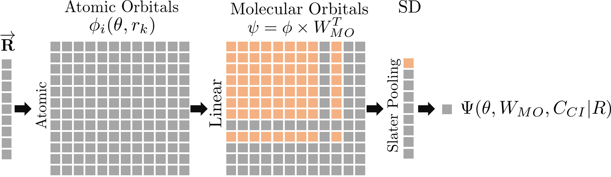
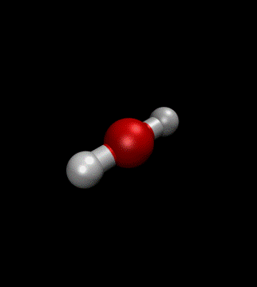

# QMCTorch

Pytorch Implementation of Real Space Quantum Monte Carlo Simulations of Molecular Systems

[](https://travis-ci.com/NLESC-JCER/QMCTorch)
[](https://coveralls.io/github/NLESC-JCER/QMCTorch?branch=master)
[](https://www.codacy.com/manual/NicoRenaud/QMCTorch?utm_source=github.com&amp;utm_medium=referral&amp;utm_content=NLESC-JCER/QMCTorch&amp;utm_campaign=Badge_Grade)
[](https://doi.org/10.5281/zenodo.3780094)

## Documentation 
https://qmctorch.readthedocs.io/en/latest/intro.html


<!-- 
## Introduction

QMCTorch allows to leverage deep learning to optimize QMC wave functions. The package offers solutions to optimize particle-in-a-box model as well as molecular systems. It uses `pytorch` as a deep learning framework and `pyscf` or `adf` to obtain the basis set information and the first guess of the molecular orbitals.

The three main ingredients of any calculations are :

* a neural network that calculates the value of the wave function at a given point
* a sampler able to generate sampling points of the wave function
* an optimizer (as those provided by `pytorch`)

The wave function is encoded in the simple multilayer neural network depicted below:

<p align="center">

</p>

Starting from the positions of the walkers, the `AtomicOrbital` layer computes the value of each atomic orbital for each electrons. The second layer is a linear transformation that computes the molecular orbital as linear combination of AOs. Then the `SlaterPooling` finally computes the value of the Slater determinant and the last layer create the CI expansion. A `Jastrow` layer also computes the Jastrow factor that is multiplied with the CI expansion. 

## Wave function optmization of H2

As an illustrative example let's optimize the wave function of H2 using the following script :

```python
import sys
from torch import optim

from qmctorch.wavefunction import Orbital, Molecule
from qmctorch.solver import SolverOrbital
from qmctorch.sampler import Metropolis
from qmctorch.utils import plot_energy, set_torch_double_precision

set_torch_double_precision()

# define the molecule
mol = Molecule(atom='H 0 0 -0.69; H 0 0 0.69',
               calculator='pyscf',
               basis='dzp',
               unit='bohr')

# define the wave function
wf = Orbital(mol, configs='cas(2,2)')

#sampler
sampler = Metropolis(nwalkers=500, nstep=2000, step_size=0.2,
                     ndim=wf.ndim, nelec=wf.nelec,
                     init=mol.domain('atomic'),
                     move={'type': 'all-elec', 'proba': 'normal'})

# optimizer
lr_dict = [{'params': wf.jastrow.parameters(), 'lr': 3E-3},
           {'params': wf.ao.parameters(), 'lr': 1E-6},
           {'params': wf.mo.parameters(), 'lr': 1E-3},
           {'params': wf.fc.parameters(), 'lr': 3E-3}]
opt = optim.Adam(lr_dict)

# scheduler
scheduler = optim.lr_scheduler.StepLR(opt, step_size=100, gamma=0.90)

# solver
solver = SolverOrbital(wf=wf, sampler=sampler,
                       optimizer=opt, scheduler=None)

# optimize jatrow and CI only (freeze ao and mo)
solver.configure(task='wf_opt', freeze=['ao', 'mo'])

# initial sampling
solver.initial_sampling(ntherm=1000, ndecor=100)

# resampling
solver.resampling(nstep=20)

# run the optimization
data = solver.run(250, loss='energy')

# plot the data
e, v = plot_energy(solver.obs_dict, e0=-1.1645, show_variance=True)
```

The `Molecule` class allows to easily define molecular structure and the basis set used to describe its electronic structure Gaussian (`gto`) and Slater (`sto`) atomic orbitals are supported. The `Orbital` class defines the neural network that encodes the wave function ansatz. The sampler is here set to a simple `Metroplois` using 500 walkers each performing 2000 steps. The `Adam` optimizer is chosen with a simple linear scheduler. All these objects are assembled in the `SolverOrbital` that is then configured and run for 250 epoch. The result of this optimization is depicted below :

<p align="center">

</p>

As seen here both the energy and the variance of the wave function decreases during the optimization

## Geometry optimization of a water molecule

`QMCTorch` can also be used to perform geometry optimization as the atomic coordinate are variational parameters of the `AtomicOrbital` layer. For example the following example optimize a water molecule :

```python

mol = Molecule(atom='water.xyz', unit='angs',
               calculator='pyscf', basis='dz')

# define the wave function
wf = Orbital(mol,configs='ground_state')

# sampler
sampler = Metropolis(nwalkers=1000, nstep=2000, step_size=0.2,
                     nelec=wf.nelec, ndim=wf.ndim,
                     init=mol.domain('atomic'),
                     move={'type': 'all-elec', 'proba': 'normal'})

# optimizer
opt = optim.Adam(wf.parameters(), lr=0.005)

# solver
solver = SolverOrbital(wf=wf, sampler=sampler,optimizer=opt)
solver.configure(task='geo_opt')
solver.observable(['local_energy','atomic_distances'])
solver.run(50,loss='energy')
solver.save_traj('h2o_traj.xyz')
```

Note that comfiguring the solver to perform a geometry optimization is done in one single line. The results of this optimization is shown below :

<p align="center">

</p> -->
