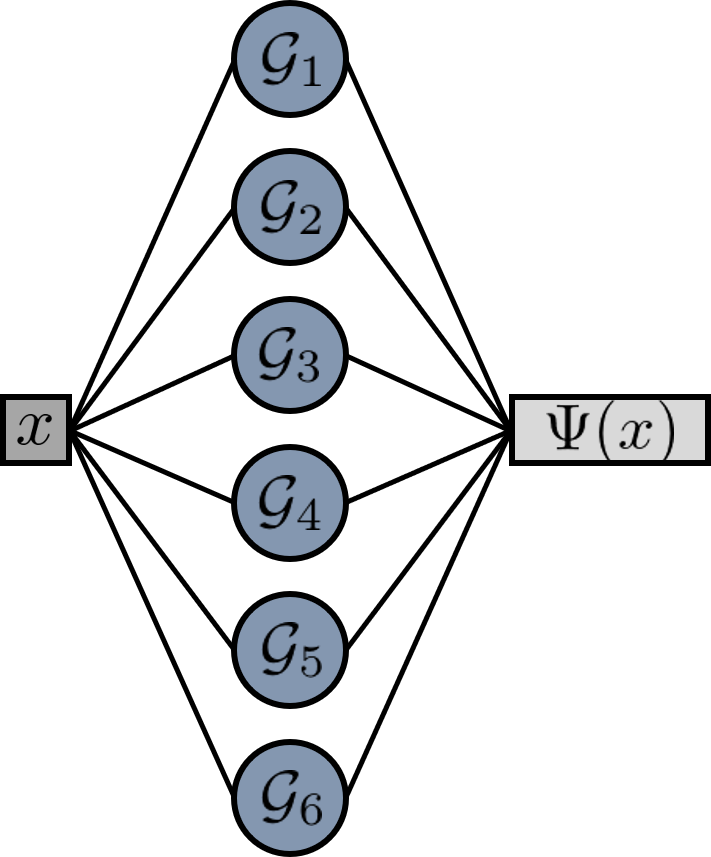
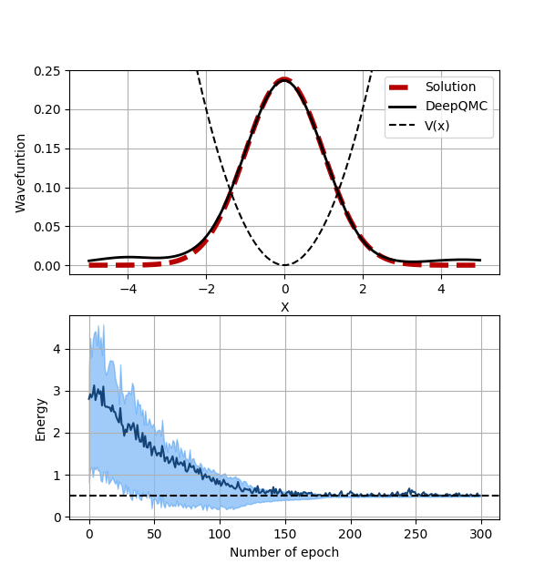

# DeepQMC

Deep Learning for Quantum Monte Carlo Simulations

## Introduction

DeepQMC allows to leverage deep learning to optimize QMC wave functions. The package offers solutions to optimize particle-in-a-box model as well as molecular systems. It uses `pytorch` as a deep learning framework and `pyscf` to obtain the first guess of the molecular orbitals. 

The three main ingredients of any calculations are :

  * a neural network that calculates the value of the wave function at a given point
  * a sampler able to generate sampling points of the wave function
  * an optimizer (as those provided by `pytorch`) 

## Harmonic Oscillator in 1D

The script below illustrates how to optimize the wave function of the one-dimensional harmonic oscillator `DeepQMC`. 

```python
import torch
import torch.optim as optim

from deepqmc.sampler.metropolis import  Metropolis
from deepqmc.wavefunction.wf_potential import Potential
from deepqmc.solver.solver_potential import SolverPotential
from deepqmc.solver.plot_potential import plot_results_1d, plotter1d

# analytic solution of the problem
def sol_func(pos):
    return torch.exp(-0.5*pos**2)

# box
domain, ncenter = {'xmin':-5.,'xmax':5.}, 5

# potential function
def pot_func(pos):
    '''Potential function desired.'''
    return  0.5*pos**2

# wavefunction
wf = Potential(pot_func,domain,ncenter,nelec=1)

#sampler
sampler = Metropolis(nwalkers=250, nstep=1000, 
                     step_size = 1., nelec = wf.nelec, 
                     ndim = wf.ndim, domain = {'min':-5,'max':5})

# optimizer
opt = optim.Adam(wf.parameters(),lr=0.01)

# define solver
solver = SolverPotential(wf=wf,sampler=sampler,optimizer=opt)

# train the wave function
plotter = plotter1d(wf,domain,50,sol=sol_func)
solver.run(100, loss = 'variance', plot = plotter )


# plot the final wave function 
plot_results_1d(solver,domain,50,sol_func,e0=0.5)
```

The `pot_func` function defines the potential for which we want to optimize the wave function. It is here given by a simple quadratic function. 

After defining the domain in `domain` and the number of basis function in `ncenter`, we instantiate the `Potential` wave function class. This class defines a very simple neural network that, given a position computes the value of the wave function at that point. This neural network is composed of a layer of radial basis functions followed by a fully conneted layer to sum them up:

<p align="center">

</p>

The then instantiate the sampler, here a simple `Metroplis` scheme. The sampler is used to sample the wave function and hence generate a bach of sampling points. These points are used as input of the neural network the compute the values of wave function at those points. We finally select the `Adam` optimizer to optimize the wave function paramters. 

We then define a `SolverPotential` instance that ties all the elements together and train the model to optimize the wave function paramters. We here use the variance of the sampling point energies as a loss and run 100 epochs. Many more parameters are accessible in the training routines.

After the optimization, the following result is obtained:

<p align="center">

</p>


## Dihydrogen molecule

`DeepQMC` also allows optimizing the wave function and the geometry of molecular systems through the use of dedicated classes. For example the small script below allows to compute the energy of a H2 molecule using a few lines.

```python
import sys
from torch.optim import Adam

from deepqmc.wavefunction.wf_orbital import Orbital
from deepqmc.solver.solver_orbital import SolverOrbital 
from deepqmc.sampler.metropolis import Metropolis
from deepqmc.wavefunction.molecule import Molecule
from deepqmc.solver.plot_data import plot_observable

# define the molecule
mol = Molecule(atom='H 0 0 -0.37; H 0 0 0.37', basis_type='sto', basis='sz')

# define the wave function
wf = Orbital(mol)

#sampler
sampler = Metropolis(nwalkers=1000, nstep=1000, step_size = 0.5, 
                     ndim = wf.ndim, nelec = wf.nelec, move = 'one')

# optimizer
opt = Adam(wf.parameters(),lr=0.01)

# solver
solver = SolverOrbital(wf=wf,sampler=sampler,optimizer=opt)

# optimize the geometry
solver.configure(task='geo_opt')
solver.run(100,loss='energy')

# plot the data
plot_observable(solver.obs_dict,e0=-1.16)
```

The main difference compared to the harmonic oscillator case is the definition of the molecule via the `Molecule` class and the definition of the wave function that is now given by the `Orbital` class. The `Molecule` object specifies the geometry of the system and the type of orbitals required. So far only `sto` and `gto` are supported. The `Orbital` class defines a neural network encoding the wave fuction ansatz. The network takes as input the positions of the electrons in the system and compute the corresponding value of the wave function using the architecture depicted below:

<p align="center">

</p>

Starting from the positions of the electrons in the system, we have define an `AtomicOrbital` layer that evaluates the values of all the atomic orbitals at all the electron positions. This is in spirit similar to the RBF layer used in the `Potential` wave function used in the previous example. The `AtomicOrbital` layer has several variational paramters: atomic positions, basis function exponents and coefficients. These parameters can be optimized during the training. 

The network then computes the values of the molecular orbitals from those of the atomic orbitals. This achieved by a simple linear layer whose transformation matrix is given by the molecular orbital coefficients. These coefficients are also variational parameters of the layer and can therefore be optimized.

We then have defined a `SlaterPooling` layer that computes the values of all the required Slater determinants. The `SlaterPooling` operation is achieved by masking the molecular orbitals contained in the determinant, and by then taking the determinant of this submatrix. We have implemented `BatchDeterminant` layer to accelerate this operation.

Finally a fully connected layer sums up all the determinants. The weight of this last layer are the CI coefficients that can as well be optimized.

In parallel we also have defined a `JastrowFactor` layer that computes the e-e distance and the value of the Jastrow factor. There again the parameters of the layer can be  optimized during the training of the wave function.

The script presented above configures then the solver to run a geometry optimization on the model using the energy of the sampling points as a loss.


The figure below shows the evolution of the system's eneergy during the geometry optimization of the molecule. 

<p align="center">

</p>


