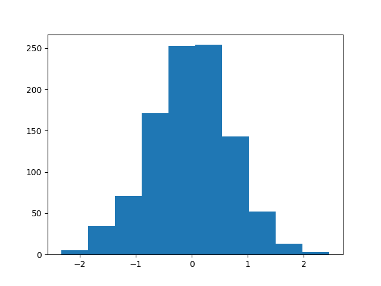
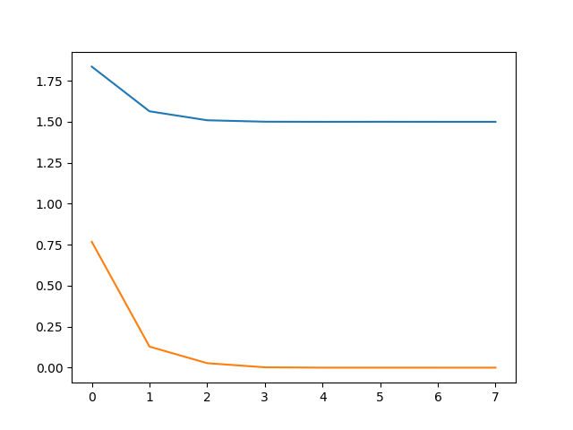
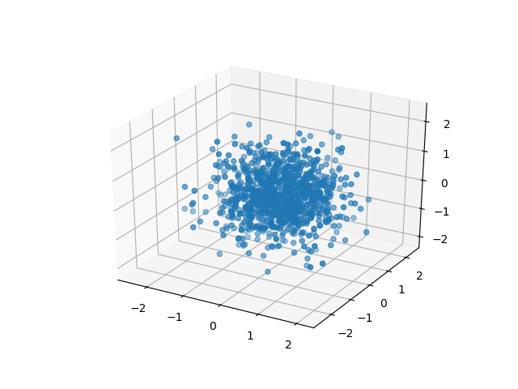

# pyCHAMP

Quantum Monte Carlo code in Python

## Introduction


pyCHAMP allows to run small Variational QMC calculations in Python. Diffusion Monte Carlo is currently under developement Only a few features are currently supported : 

### Sampler : 

  * Metropolis-Hasting
  * Hamiltonian Monte-Carlo

### Optimizers :

  * Scipy Minimize routines (BFGS, Simplex, .... )
  * Linear Method
  
  
`pyChamp` tries to use `autograd` as much as possible to define the partial derivatives of the wave function, alleviating the necessaity to derive analytic expressions

## Example : VMC Single point calculation 1D Harmonic oscillator with 1-electron

```python

from pyCHAMP.wavefunction.wf_base import WF
from pyCHAMP.sampler.metropolis import METROPOLIS
from pyCHAMP.solver.vmc import VMC

class HarmOsc1D(WF):

    def __init__(self,nelec,ndim):
        WF.__init__(self, nelec, ndim)

    def values(self,parameters,pos):
        ''' Compute the value of the wave function.
        Args:
            parameters : parameters of th wf
            x: position of the electron
        Returns: values of psi
        '''
    
        beta = parameters[0]
        return np.exp(-beta*pos**2).reshape(-1,1)

    def nuclear_potential(self,pos):
        return 0.5*pos**2 

    def electronic_potential(self,pos):
        return 0
        
wf = HarmOsc1D(nelec=1, ndim=1)
sampler = METROPOLIS(nwalkers=1000, nstep=1000, step_size = 3, nelec=1, ndim=1, domain = {'min':-2,'max':2})

vmc = VMC(wf=wf, sampler=sampler, optimizer=None)
opt_param = [0.5]
pos, e, s = vmc.single_point(opt_param)

print('Energy   : ', e)
print('Variance : ', s)
vmc.plot_density(pos)
```

This script will output :

```
Energy   :  0.5000007216288713
Variance :  2.8121093888720785e-09
``` 

and plot the following distribution 



## Example : VMC optimization of a 3D Harmonic oscillator with 1-electron

```python

import autograd.numpy as np

from pyCHAMP.wavefunction.wf_base import WF
from pyCHAMP.sampler.metropolis import METROPOLIS
from pyCHAMP.optimizer.minimize import MINIMIZE
from pyCHAMP.solver.vmc import VMC

class HarmOsc3D(WF):

	def __init__(self,nelec,ndim):
		WF.__init__(self, nelec, ndim)

	def values(self,parameters,pos):
		''' Compute the value of the wave function.

		Args:
			parameters : variational param of the wf
			pos: position of the electron

		Returns: values of psi
		# '''
		# if pos.shape[1] != self.ndim :
		# 	raise ValueError('Position have wrong dimension')

		beta = parameters[0]
		return np.exp(-beta*np.sum(pos**2,1)).reshape(-1,1)

	def nuclear_potential(self,pos):
		return np.sum(0.5*pos**2,1).reshape(-1,1)

	def electronic_potential(self,pos):
		return 0

wf = HarmOsc3D(nelec=1, ndim=3)
sampler = METROPOLIS(nwalkers=1000, nstep=1000, step_size=3, nelec=1, ndim=3, domain = {'min':-2,'max':2})
optimizer = MINIMIZE(method='bfgs', maxiter=20, tol=1E-4)

# VMC solver
vmc = VMC(wf=wf, sampler=sampler, optimizer=optimizer)

# optimiztaion
init_param = [0.25]
vmc.optimize(init_param)
vmc.plot_history()
``` 

will output :

```
0 energy = 1.836533, variance = 0.767677 (beta=0.250000)
1 energy = 1.564179, variance = 0.128395 (beta=0.374170)
2 energy = 1.509419, variance = 0.027333 (beta=0.436731)
3 energy = 1.500715, variance = 0.002094 (beta=0.481135)
4 energy = 1.499970, variance = 0.000016 (beta=0.498338)
5 energy = 1.500326, variance = 0.000019 (beta=0.498338)
6 energy = 1.500002, variance = 0.000000 (beta=0.499981)
7 energy = 1.499989, variance = 0.000000 (beta=0.499998)
```

leading to the following plot :



and the following point distribution :


