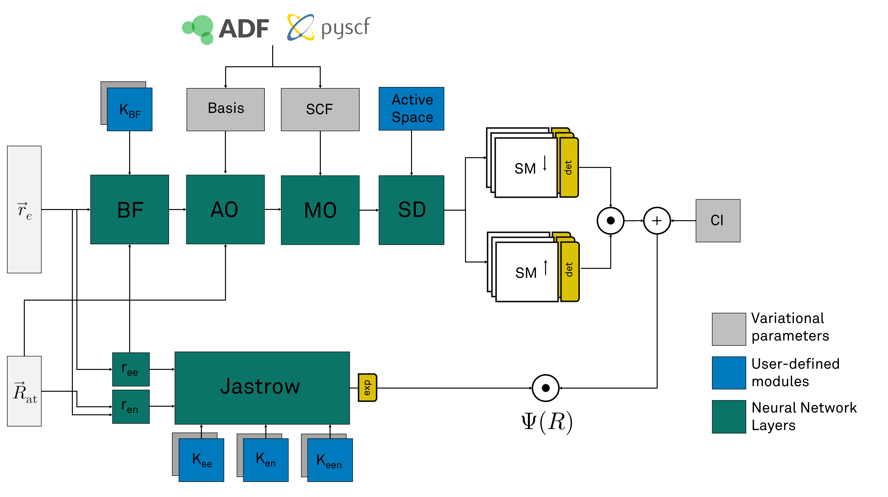

Neural Network Wave Function
================================

QMCTorch expresses the wave function of a molecular structure as a neural network. In most cases this network takes the electronic positions as input
and returns the corresponding value of the wave function. The general architecture of the netwrok is shown below

Starting form the electronic and atomic positions, each layer of the network compute physically-motivated transformation that result in the value of the wave function. 

.. toctree::
   :maxdepth: 1
   :caption: Wavefunction Ansatz:

   slaterjastrow
   slaterjastrow_backflow

