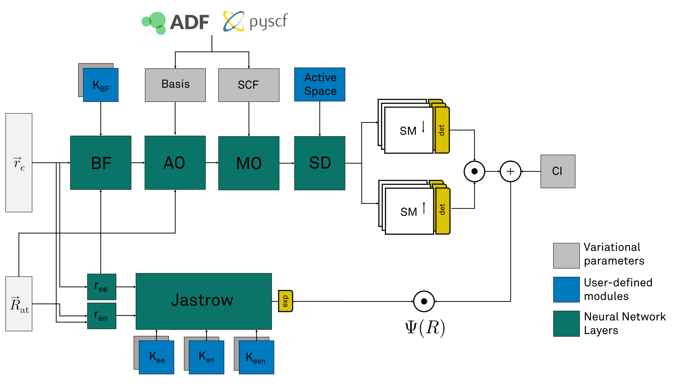

QMCTorch
===========================================

`QMCTorch` allows to epxress the wave function ususally used by QMC practitioner as neural network. The most generic architecture of the
neural network used by the code is:

Different wave function forms have been implemented to easily create and use wave function ansatz

Two-body Jastrow factors
^^^^^^^^^^^^^^^^^^^^^

* ``SlaterJastrow``: A simple wave function containing an electron-electron Jastrow factor and a sum of Slater determinants 
* ``SlaterOrbitalDependentJastrow``: A  ``SlaterJastrow`` for but each molecular orbitals has its own Jastrow factor 
* ``SlaterJastrowBackflow``: A ``SlaterJastrow`` wave function with backflow transformation for the electrons

Many-Body Jastrow factors
^^^^^^^^^^^^^^^^^^^^^
* ``SlaterCombinedJastrow``: A wave function that contains a many body Jastrow factor and a sum of Slater determinants with backflow transformation for the electrons
* ``SlaterCombinedJastrowBackflow``: A ``SlaterCombinedJastrow`` wave function with a backflow transformation

Slater Jastrow Wave Function
----------------------------------------

The simplest wave function implemented in `QMCTorch` is a Slater Jastrow form. Through a series of transformations 
the Slater Jastrow function computes:

.. math::
    \Psi(R) = J(R) \sum_n c_n D_n^{\uparrow} D_n^{\downarrow}

The term `J(R)` is the so called Jastrow factor that captures the electronic correlation. By default, the Jastrow factor is given by :

.. math::

    J(R) = \exp\left(  \sum_{i<j} \text{Kernel}(r_{ij}) \right)

where the sum runs over all the electron pairs and where the kernel function defines the action of the Jastrow factor. A common expression for the
kernel (and the default option for QMCTorch) is the Pade-Jastrow form given by:

.. math::

    \text{Kernel}(r_{ij}) = \frac{\omega_0 r_{ij}}{1+\omega r_{ij}}

where :math:`\omega_0` is a fixed coefficient equals to 0.25(0.5) for antiparallel(parallel) electron spins and :math:`\omega` a variational parameter.

The determinantal parts in the expression of :math:`\Psi` are given by the spin-up and spin-down slater determinants e.g. :

.. math::

    D_n^{\uparrow} = \frac{1}{\sqrt{N}} \begin{vmatrix} & & \\ & \phi_j(r_i) & \\ & & \end{vmatrix}

A ``SlaterJastrow`` wave function can instantiated following :

>>> wf = SlaterJastrow(mol, configs='single_double(2,2)', jastrow_kernel=PadeJastrowKernel)

The ``SlaterJastrow`` takes as first mandiatory argument a ``Molecule`` instance. The Slater determinants required in the calculation
are specified with the ``configs`` arguments which can take the following values :

  * ``configs='ground_state'`` : only the ground state SD
  * ``configs='cas(n,m)'`` : complete active space using n electron and m orbitals
  * ``configs='single(n,m)'`` : only single excitation using n electron and m orbitals
  * ``configs='single_double(n,m)'`` : only single/double excitation using n electron and m orbitals

Finally the kernel function of the Jastrow factor can be specifed using the ``jastrow_kernel``
The ``SlaterJastrow`` class accepts other initialisation arguments to fine tune some advanced settings. The default values
of these arguments are adequeate for most cases.

Orbital dependent Slater Jastrow Wave Function
---------------------------------------------------

A slight modification of the the Slater Jastrow is obtained by making the the Jastrow factor can be made orbital dependent. 
This is implemented in the ``SlaterOrbitalDependentJastrow`` that can be instantiated as:

>>> from qmctorch.wavefunction import SlaterOrbitalDependentJastrow
>>> from qmctorch.wavefunction.jastrows.elec_elec.kernels import PadeJastrowKernel
>>> wf = SlaterOrbitalDependentJastrow(mol, configs='single_double(2,4)'
>>>                                    jastrow_kernel=PadeJastrowKernel)

Slater Jastrow Backflow Wave Function
----------------------------------------

The Slater Jastrow Backflow wave function builds on the the Slater Jastrow wavefunction but adds a backflow transformation to
the electronic positions. Following this transformation, each electron becomes a quasi-particle whose position depends on all
electronic positions. The backflow transformation is given by :

.. math::

    q(x_i) = x_i + \sum_{j\neq i} \text{Kernel}(r_{ij}) (x_i-x_j)

The kernel of the transformation can be any function that depends on the distance between two electrons. A popular kernel
is simply the inverse function :

.. math::
    \text{Kernel}(r_{ij}) = \frac{\omega}{r_{ij}}

and is the default value in QMCTorch. However any other kernel function can be implemented and used in the code.

The wave function is then constructed as :

.. math::

    \Psi(R) = J(R) \sum_n c_n D_n^{\uparrow}(Q) D_n^{\downarrow}(Q)

The Jastrow factor is still computed using the original positions of the electrons while the determinant part uses the
backflow transformed positions.

Orbital Dependent Backflow Transformation
-----------------------------------------------

The backflow transformation can be different for each atomic orbitals.

.. math::

    q^\alpha(x_i) = x_i + \sum_{j\neq i} \text{Kernel}^\alpha(r_{ij}) (x_i-x_j)

where each orbital has its dedicated backflow kernel. This provides much more flexibility when optimizing the wave function.

This wave function can be used with

>>> from qmctorch.wavefunction import SlaterJastrowBackFlow
>>> from qmctorch.wavefunction.orbitals.backflow.kernels import BackFlowKernelInverse
>>> from qmctorch.wavefunction.jastrows.elec_elec.kernels.pade_jastrow_kernel import PadeJastrowKernel
>>>
>>> wf = SlaterJastrowBackFlow(mol, 
>>>                            configs='single_double(2,2)',
>>>                            jastrow_kernel=PadeJastrowKernel,
>>>                            orbital_dependent_backflow=False,
>>>                            backflow_kernel=BackFlowKernelInverse)

Compared to the ``SlaterJastrow`` wave function, the kernel of the backflow transformation must be specified.
By default the inverse kernel will be used. Orbital dependent backflow orbitals can be easily achieved by using ``orbital_dependent_backflow=True``

Many-Body Jastrow Wave Function
----------------------------------------

The Jastrow factor combines here multiple terms that represent electron-electron, electron-nuclei and electron-electron-nuclei terms. 

.. math::

    J(R_{at},r) = \exp\left(  \sum_{i<j} K_{ee}(r_i, r_j) + \sum_{i,\alpha}K_{en}(R_\alpha, r_i) + \sum_{i<j,\alpha} K_{een}(R_\alpha, r_i, r_j) \right)

>>> from qmctorch.wavefunction import SlaterCombinedJastrow
>>> from qmctorch.wavefunction.jastrows.elec_elec.kernels.pade_jastrow_kernel import PadeJastrowKernel as PadeJastrowElecElec
>>> from qmctorch.wavefunction.jastrows.elec_nuclei.kernels.pade_jastrow_kernel import PadeJastrowKernel as PadeJastrowKernelElecNuc
>>> from qmctorch.wavefunction.jastrows.elec_elec_nuclei.kernels.boys_handy_jastrow_kernel import BoysHandyJastrowKernel
>>>
>>> wf = SlaterCombinedJastrow(mol, 
>>>                            configs='single_double(2,2)',
>>>                            jastrow_kernel={
>>>                                 'ee': PadeJastrowKernelElecElec,
>>>                                 'en': PadeJastrowKernelElecNuc,
>>>                                 'een': BoysHandyJastrowKernel})

Many-Body Jastrow Wave Function with backflow transformation 
------------------------------------------------------------------

A backflow transformation can be used together with the many body Jastrow

>>> from qmctorch.wavefunction import SlaterCombinedJastrowBackflow
>>> from qmctorch.wavefunction.jastrows.elec_elec.kernels.pade_jastrow_kernel import PadeJastrowKernel as PadeJastrowElecElec
>>> from qmctorch.wavefunction.jastrows.elec_nuclei.kernels.pade_jastrow_kernel import PadeJastrowKernel as PadeJastrowKernelElecNuc
>>> from qmctorch.wavefunction.jastrows.elec_elec_nuclei.kernels.boys_handy_jastrow_kernel import BoysHandyJastrowKernel
>>>
>>> wf = SlaterCombinedJastrowBackflow(mol, 
>>>                            configs='single_double(2,2)',
>>>                            jastrow_kernel={
>>>                                 'ee': PadeJastrowKernelElecElec,
>>>                                 'en': PadeJastrowKernelElecNuc,
>>>                                 'een': BoysHandyJastrowKernel},
>>>                             backflow_kernel=BackFlowKernelInverse)