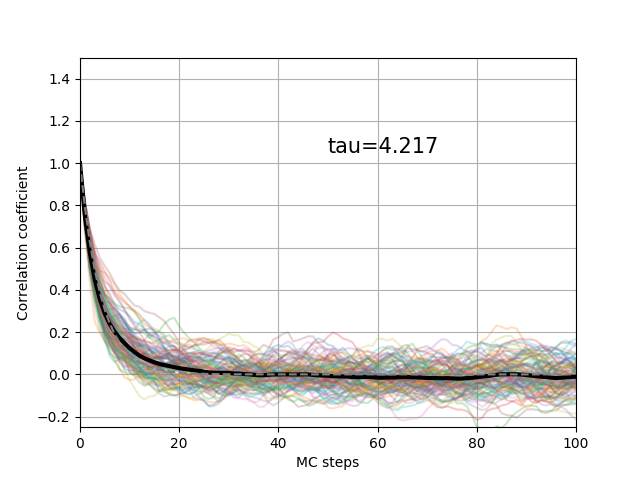
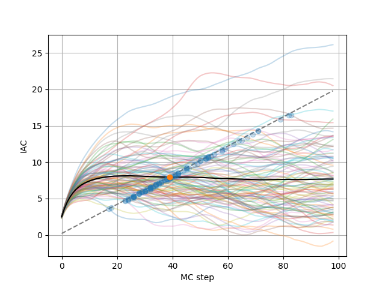
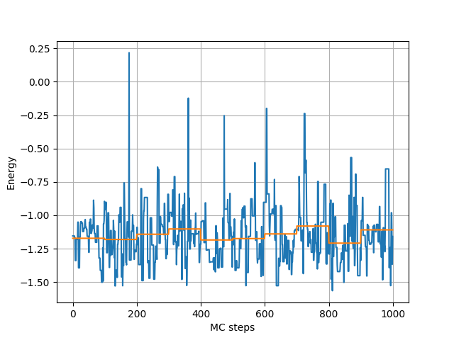

Correlation and Blocking
========================================

One important part of the sampling is to estimate the correlation between the different sampling points.
To this end let's import the following modules

>>> from qmctorch.scf import Molecule
>>> from qmctorch.wavefunction import SlaterJastrow
>>> from qmctorch.sampler import Metropolis
>>> from qmctorch.utils import set_torch_double_precision
>>> from qmctorch.utils import blocking, plot_blocking_energy
>>> from qmctorch.utils import plot_correlation_coefficient, plot_integrated_autocorrelation_time

To obtain a bettter accuracy on our results we can switch to a double precision default
tensor type for pytorch :

>>> set_torch_double_precision()

Correlation coefficient
^^^^^^^^^^^^^^^^^^^^^^^^^^^^^^^^^^^^^^^^
The simplest way to estimate the decorelation time is to compute the autocorrelation coefficient of the local energy.
After having defined the molecule and the wave function as in the previous tutorial, let's define the sampler as follow:

>>> sampler = Metropolis(nwalkers=100, nstep=500, step_size=0.25,
>>>                     nelec=wf.nelec, ndim=wf.ndim,
>>>                     init=mol.domain('normal'),
>>>                     ntherm=0, ndecor=1,
>>>                     move={'type': 'all-elec', 'proba': 'normal'})

Compared to before we here record all the walker position along the trajectory. We can then define the solver as before
and run the following commands:

>>> pos = solver.sampler(solver.wf.pdf)
>>> obs = solver.sampling_traj(pos)
>>> rho, tau = plot_correlation_coefficient(obs.local_energy)

Which gives the following plot:

On this picture is represented the autocorrelation coefficient of the local energy of all the walkers (transparent colorful line)
and the average of the autocorrelation coefficient (thick black line). This mean value is fitted with an exponential decay
to obtain the autocorrelation time that is here equal to 4.13 MCs.

Integrated autocorrelation time
^^^^^^^^^^^^^^^^^^^^^^^^^^^^^^^^^^^^^^^^^^^^^^^^^^

Another way to estimate the correlation time is to compute the integrated autocorrelation time. This can be done with

>>> plot_integrated_autocorrelation_time(obs.local_energy)

That leads to the following plot

A conservative estimate of the correlation time can be obtain when the iac cross the dashed line, leading here to a value of about 7 steps.

Energy blocking
^^^^^^^^^^^^^^^^^^^^^^^^^^^^^^^^^^^^^^^^^^^^^^^^^^^^^

It is also common practice to use blocking of the local energy values to reduce the variance. This can easily be done with

>>> eb = plot_blocking_energy(obs.local_energy, block_size=100,
>>>                           walkers='mean')

leading to the plot

That shows the raw and blocked values of the mean local energy values.

