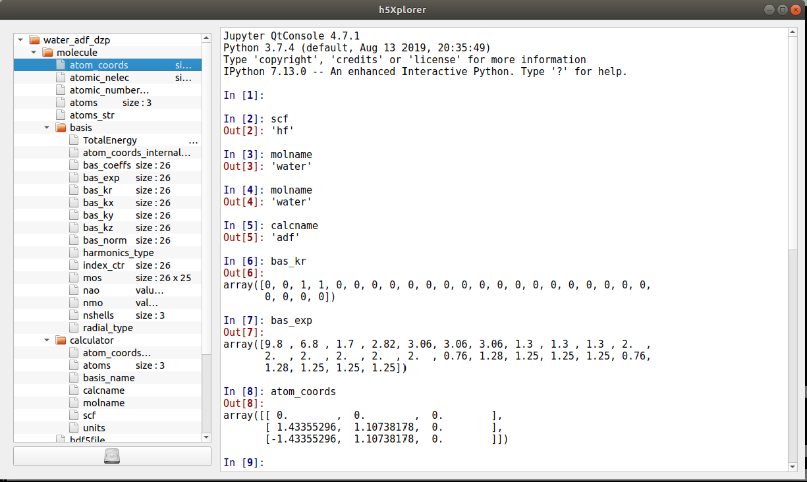
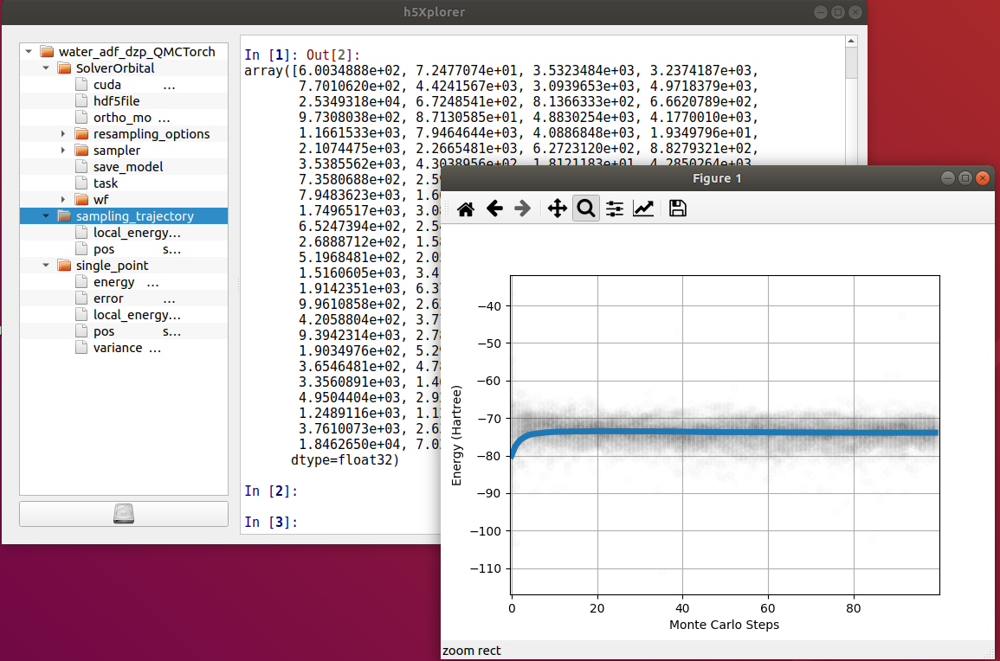

Exploring the results with h5x
=====================================

The results and input of any the calculation performed by QMCTorch is stored in a dedicated HDF5 File
that can be explored using h5x. To lauch h5x simply execute tehe python file in the h5x folder

::

    cd QMCTroch/h5x
    python h5x.py 

This will start the browser where you can laod and explore data files.

SCF calculation
^^^^^^^^^^^^^^^^^^^^^^^^^^^

The result of any SCF calculation generates an hdf5 file named by default

::

    <molecule_name>_<calculator>_<basis>.hdf5

Another name can be specified via the Molecule argument. This file contains all the data of the Molecule instance, in particular the basis set information, used in the calculation.
By browsing the file using h5x you can retreive any information needed. This file is also reused if possible to avoid computing the SCF of a previously studied molecular system.

QMCTorch calculation
^^^^^^^^^^^^^^^^^^^^^^^^^^^^^^^^^

The results of QMCTorch calculation are also stored in a hdf5 file named

::

    <molecule_name>_<calculator>_<basis>_QMCTorch.hdf5

Another name can be specified via the Solver argument. This file contains all the information about the 
wavefunction, the sampler the solver and the results of all the calculations performed in the script.
Context menus have been incorporate in order to plot the results directly from the hdf5 file.

