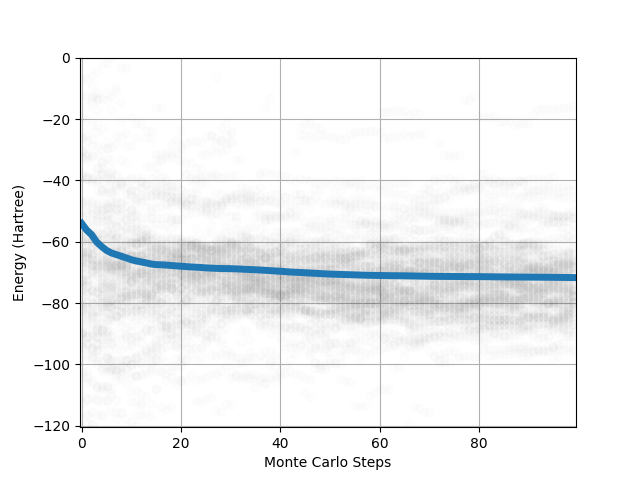
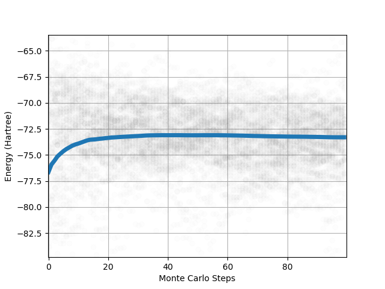

Single point and Sampling trajectory
========================================

In this first tutorial we are going to define a simple molecule and sample its wave function.
Let's start by importing all the modules we need :

>>> from qmctorch.wavefunction import SlaterJastrow, Molecule
>>> from qmctorch.sampler import Metropolis
>>> from qmctorch.utils import set_torch_double_precision
>>> from qmctorch.utils import plot_walkers_traj

To obtain a bettter accuracy on our results we can switch to a double precision default
tensor type for pytorch :

>>> set_torch_double_precision()

Gaussian orbitals : STO-3G with pyscf
^^^^^^^^^^^^^^^^^^^^^^^^^^^^^^^^^^^^^^^^

We now  need to define the molecule. We are here going to read the position of a water molecule from an xyz file.
The coordinates of an XYZ files are in Angstrom and we therefore specify this unit when defining the molecule.
We choose here to use pyscf with a samall sto-3g basis set to perform the SCF calculation on the molecule.

>>> # define the molecule
>>> mol = Molecule(atom='water.xyz', unit='angs',
>>>               calculator='pyscf', basis='sto-3g')

We can now define the QMCNet wavefunction. We choose here to include only the ground state of the of the system in the CI expansion.
The kinetic energy of the system will be computed using the Jacobi formula instead of the hessian of the wave function  wrt the electron positions through automatic differentiation.
We also include a Jastrow factor in the calculation of the wave function.

>>> # define the wave function
>>> wf = SlaterJastrow(mol, kinetic='jacobi',
>>>             configs='ground_state',
>>>             use_jastrow=True)

We then define the sampler as Metropolis Hasting samper, using only100 walkers. Each walker is initially in a shpere around the molecule.
During the MC sampling each walker performs 500 steps of 0.25 atomic units. We here move only 1 electron per MC step per walkers using a normal distribution centred around their current position.

>>> # sampler
>>> sampler = Metropolis(nwalkers=100, nstep=500, step_size=0.25,
>>>                     nelec=wf.nelec, ndim=wf.ndim,
>>>                     init=mol.domain('normal'),
>>>                     move={'type': 'one-elec', 'proba': 'normal'})

We can now assemble the solver.

>>> # solver
>>> solver = SolverOrbital(wf=wf, sampler=sampler)

We can first perform  a single point calculation.
In this calculation the solver will sample the wave function and compute the energy of the system.

>>> obs = solver.single_point()

::

    Energy   :  -71.28987884521484  +/-  1.5550774335861206
    Variance :  241.82656860351562

This leads to an energy of about E = -71 hartrees witha  very large error bar of several hartrees. This bad result is due to the basis set
we are using here (sto-3g) that is a poor approximation of the slater orbitals.

To understand how the sampling works we can compute and visualize the sampling trajectory. To this end we are going to change the parameters of th sampler so that it keeps
the position of the walkers during the MC sampling. We will therefore keep the walker positions each 5 MC step starting from their initial positions.

>>> solver.sampler.ntherm = 0
>>> solver.sampler.ndecor = 5

We then have to sample the wave function and computes the energy for each sampling interval.

>>> pos = solver.sampler()
>>> obs = solver.sampling_traj(pos)

We can now visualize the results.

>>> plot_walkers_traj(obs.local_energy, walkers='mean')

Slater orbitals : DZP with ADF
^^^^^^^^^^^^^^^^^^^^^^^^^^^^^^^^^^

It is possible to improve the results bu using ADF as a calculator and a DZP basis set. We can hence change the molecule to :

>>> # define the molecule
>>> mol = Molecule(atom='water.xyz', unit='angs',
>>>               calculator='adf', basis='dzp')

Without changing anything else in the calculation we now obtain a smaller error bar on the energy (few tenth of hartrees).

::

    Energy   :  -72.27135467529297  +/-  0.36148950457572937
    Variance :  13.06746768951416

and the following graph:

