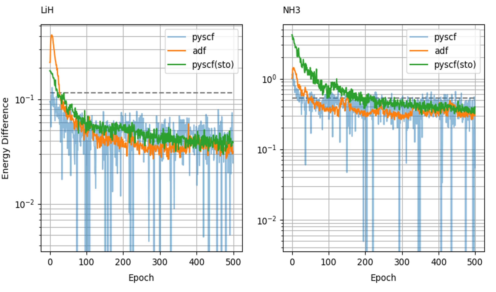

# Summary

Quantum Monte-Carlo (QMC) simulations allow to compute the electronic structure of quantum systems
with high accuracy at a relatively low computational cost. QMC relies on the definition of a wave
function ansatz that is optimized to minimize the total eneregy of the quantum systems. `QMCTorch`
allows to recast this optimization as a deep-learning problem where the wave function ansatz is expressed
as a physically-motivated neural network. The use of PyTorch as a backend to perform the optimization allows 
leveraging automatic differentiation to compute the gradient of the total energy wrt the variational parameters
as well as GPU offloading to accelerate the calculation. `QMCTorch` is interfaced with popular quantum chemistry packages
to facilitate its utilisation and help its adoption by quantum chemists and material scientists.  

# Statement of need

`QMCTorch` is a Python package using PyTorch [@pytorch] as a backend to perform Quantum Monte-Carlo (QMC) simulations of molecular systems. Many software such as `QMCPack`[@qmcpack], `QMC=Chem` [@qmcchem], `CHAMP` [@champ] provide high-quality implementation of advanced QMC methodologies in low-level languages (C++/Fortran).  Python implementations of QMC such as `PAUXY` [@pauxy] and `PyQMC` [@pyqmc] have also been proposed to facilitate the use and development of QMC techniques. Recently large efforts have been made to leverage recent development of deep learning techniques for QMC simulations. Hence neural-network based wave-function ansatz has been proposed [@paulinet; @ferminet]. These recent advances lead to very interesting results but lack in explainability of the resulting wave function ansatz. `QMCTorch` allows to perform QMC simulations using physically motivated neural netwrok architecture that closely follows the wnave function ansatz used by QMC practitioners. As such, it still allows to leverage automatic differentiation for the calculation of the gradients of the total energy wrt the variational parameters and the GPU capabilites offered by PyTorch without loosing the physical intuition behind the wave function ansatz. 

# Wave Function Ansatz

The neural network used to encode the wave-function ansatz used in `QMCTorch` is shown in Fig. \ref{fig:arch}. As common in QMC simulations the wave function is given by the product of a Jastrow factor, $J(r)$, that accounts for electronic correlation and a sum of Slater determinants $D^\updownarrow(r_\updownarrow)$ built over molecular orbitals of the spin up or down electrons:  $\Psi(r) = J(r)\sum_n c_n D^\uparrow(r_\uparrow)D^\downarrow(r_\downarrow)$.

**Jastrow Factor** The `Jastrow` layer computes the sum of three components, an electron-electron term $K_{ee}$, an electron-nuclei term $K_{en}$ and a three body electron-electron-nuclei term $K_{een}$. The sum is then exponentiated to give the Jastrow factor: $J(r_{ee}, r_{en}) = \exp\left( K_{ee}(r_ee)+K_{en}(r_{en}) + K_{een}(r_{ee},r_{en})\right)$ where $r_{ee}$ and $r_{en}$ are the electron-electron and electron-nuclei distances. The kernel function $K_{xx}$ can be easily described by users to explore the effect that different functional form may have on the resulting optimization. Several well known forms, as for example the electron-electron Pade-Jastrow: $K(r_{ee}) = \frac{a r_{ee}}{1 + b r_{ee}}$, are already implemented and available for use. 

**Backflow Transformation** Starting from the electronic coordinates, the backflow transformation layer, `BF`, creates quasi-particles by mixing the positions of the electrons: $q_i = r_i + \sum_{i\neq j} K_{BF}(r_{ij}(r_i-r_j))$ The kernel of the backflow transformation, $K_{BF}$ can be specified by users to explore their impact on the wave function optimization. Well known transformations such as the inverse form: $K_{BF} = \frac{\omega}{r_{ij}}$ where $\omega$ is a variational parameter, are already implemented and ready to use. Users can also specify not to use a backflow transformation if they wish to.  

**Atomic Orbitals** The Atomic Orbital layer `AO` computes the values of the different atomic orbitals of the sytem at all the quasi particles positions $q_e$. Both Slater type orbitals (STOs) and Gaussian type orbitals (GTOs) are supported. The initial parameters of the AOs can directly be extracted from popular quantum chemistry codes, `pyscf` [@pyscf] and `ADF` [@adf].  The parameters of the AOs (exponents, coefficients) are then variable parameters that can be optimized to minimize the total energy. As GTOs do not respect the cusp conditions they can introduce a significan amount of noise in the QMC simulations. To mitigate this effect, QMCTorch offers the possiblity to fit GTOs to single exponent STOs.

**Molecular Orbitals** The Molecular Orbital layer `MO` computes the values of all the MOs at the positions of the quasi particles. The MO layer is a simple linear transformation defined by $\textnormal{MO} = C_{SCF} \textnormal{AO}$, where $C_{SCF}$ is the matrix of the MOs coefficients on the AOs. The initial values of these coefficients can be obtained via simple Hartree-Fock or Density Functional Theory calculation of the molecular system. These coefficients are then variational parameters that can be optimized to minimize the total energy of the system. 

**Slater Determinants** The Slater Determinants layer `SD` extracts the spin up/down of the different electronic configurations required by the user. Users can freely define the number of electrons as well as the number abd types of exctation they want to include in the definition of their wave function ansatz. The `SD` layer will extract the corresponding matrices, multiply their determinants and sum all the terms. The `CI` coefficients of the sum can be freely initialized and optimized to minimize the total energy.

The Jastrow factor and the sum of Slater determinants are then multiplied to yield the final value of the wave function calculated for the electronic and atomic positions $\Psi(R)$ with $R = \{r_e, R_{at}\}$. One can easily compute the associated value of the electronic density $\rho(R) = |\Psi(R)|^2$.

# Sampling, Cost Function & Optimization 

A simple forward pass of the neural network wave function ansatz described above can then be used to sample the electronic density using Markov-Chain Monte-Carlo techniques. Users can choose betwee Metropolis-Hasting and Hamiltoian Monte-Carlo sampling methods but different sampling methods can easily be implemented and used during the simulations. All the parameters of both methods can be controlled by the user to fine tune the sampling. Each sample, $R_i$, contains then the positions of all the electrons contained in the system. The value of local energy of the system is then computed at each sampling point and these values are summed up to compute the total energy of the system: $E = \sum_i \frac{H\Psi(R_i)}{\Psi(R_i)}$, where $H$ is the Hamiltonian of the molecular system: $H = -\frac{1}{2}\sum_e \Delta_e + V_{ee} + V_{en}$. The calculation of the Laplacian of a determinant can either be performed using automatic differentiation but analytical expressions are often preferred as they are computationally more robust and less expensive [@jacobi_trace]. The gradients of the total energy w.r.t the variational parameters of the wave function, i.e. $\frac{\partial E}{\partial \theta_i}$ are simply obtained via automatic differentiation. Thanks to this automatic differentiation, users can for example define new kernels for the backflow and Jastrow factor without having to derive analytical expressions of the energy gradients. Any optimizer included in pytorch or compatible with it can then be used to optimize the wave function. This gives users access to a wide range of optimization techniques that they can freely explore for their own use cases. Users can also decide to freeze certain variational parameters, such as the parameters of the atomic orbitals, or defined different learning rates for different layers. Note that the positions of atoms are also variational parameters, and therefore one can readily perform geometry optimization using `QMCTorch`. At the end of the optimization, all the information relative to the simulations are dumped in a dedicated HDF5 file for reproducibility purposes.

# Example

The left panel of Fig. \ref{fig:results} shows a typical example of `QMCTorch` script. A `Molecule` object is first created by specifying the atomic positions and the calculator required to run the HF or DFT calculations (here `ADF` using  a double-zeta basis set). This molecule is then used to create the `SlaterJastrow` wave function ansatz. Other options, such as the required Jastrow kernel, active space, and the use of GPUs can also be specified here. A sampler and optimizer are then defined that are then used with the wave function to instantiate the solver. This solver can then be used to optmize the variational parameters here though 250 epochs. 

The right panel of Fig. \ref{fig:results} shows typical optimization run for two different molecular structure, LiH and NH3 using `pyscf`, `ADF` and a STO fit of the `pyscf` atomic orbitals. As seen in this figure, the variance of the local energy values obtained with `pyscf` (and therefore GTOs) is a limiting factor for the optmization. A simple STO fit of these atomic orbitals leads to variance comparable to those obtained with the STO of `ADF`

# Acknowledgements

We acknowledge contributions from Felipe Zapata, Matthijs de Witt and guidance from Claudia Fillipi. The development of the code was done during the project "A Light in the Dark" from the Joint Call for Energy Research funded by the Netherlands Wetenschap Organizatie and the Netherlands eScience Center, project number 

# References